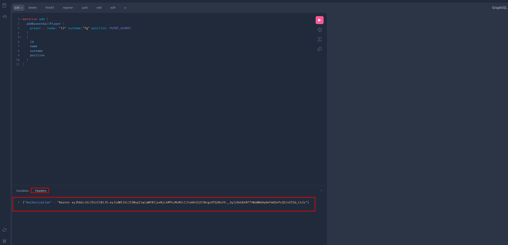

# Task
* Needs JDK19 to work
* To access H2 Console -> http://localhost:8080/h2-console
* To access Graphiql -> http://localhost:8080/graphiql
* Docker image -> https://hub.docker.com/r/alihaydargol/producter-task
# H2 

Can look audits from h2 console.

* username -> sa
* password -> password
* jdbc url -> jdbc:h2:mem:testdb

# Graphiql

Can try graphql queries. Token needed for all queries beside register and auth. 

## Creating Token

### Register

```graphql
mutation register {
    register (username : "veli") {
        authToken
    }
}
```


### Auth

```graphql
query auth {
    auth (username : "ali") {
        authToken
    }
}
```

Other operations need a token that is returned from these queries.

* You can add token to request as header with graphiql



## Schema

```graphql
type Query {
    findAll(page : Int!, size : Int!): [BasketballPlayer]
    auth(username : String!): Token
}

type Mutation {
    addBasketballPlayer(player : BasketballPlayerInput!) : BasketballPlayer
    deleteBasketballPlayer(id : ID!) : BasketballPlayer
    edit(id : ID!, name : String) : BasketballPlayer
    register(username : String) : Token
}

type Token {
    authToken: String
}

input BasketballPlayerInput {
    name: String
    surname: String
    position: Position
}

type BasketballPlayer {
    id: ID
    name: String
    surname: String
    position: Position
}

enum Position {
    POINT_GUARD
    SHOOTING_GUARD
    SMALL_FORWARD
    POWER_FORWARD
    CENTER
}
```